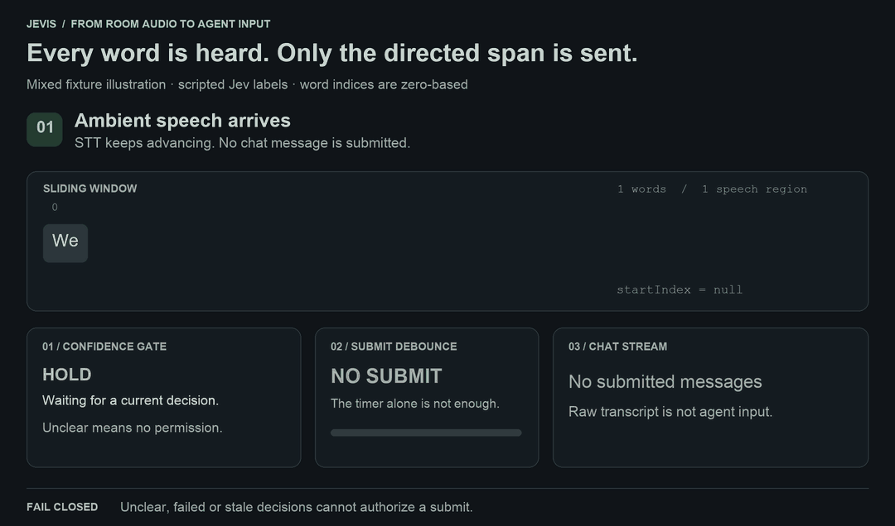
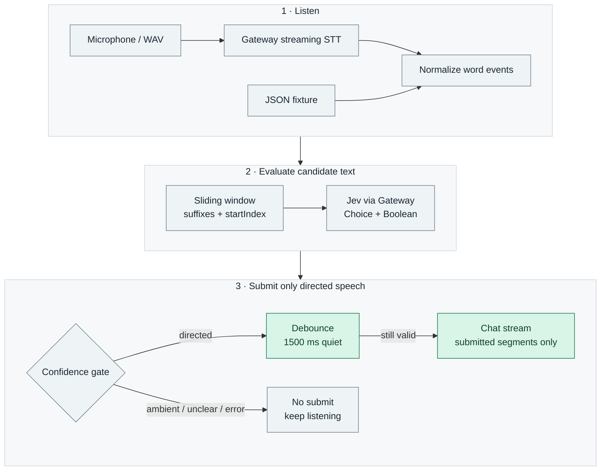
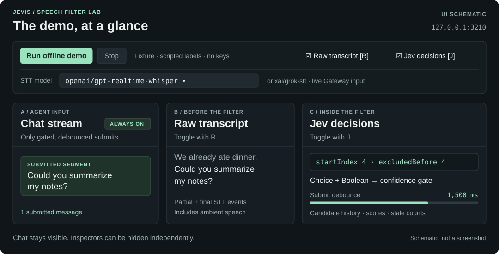
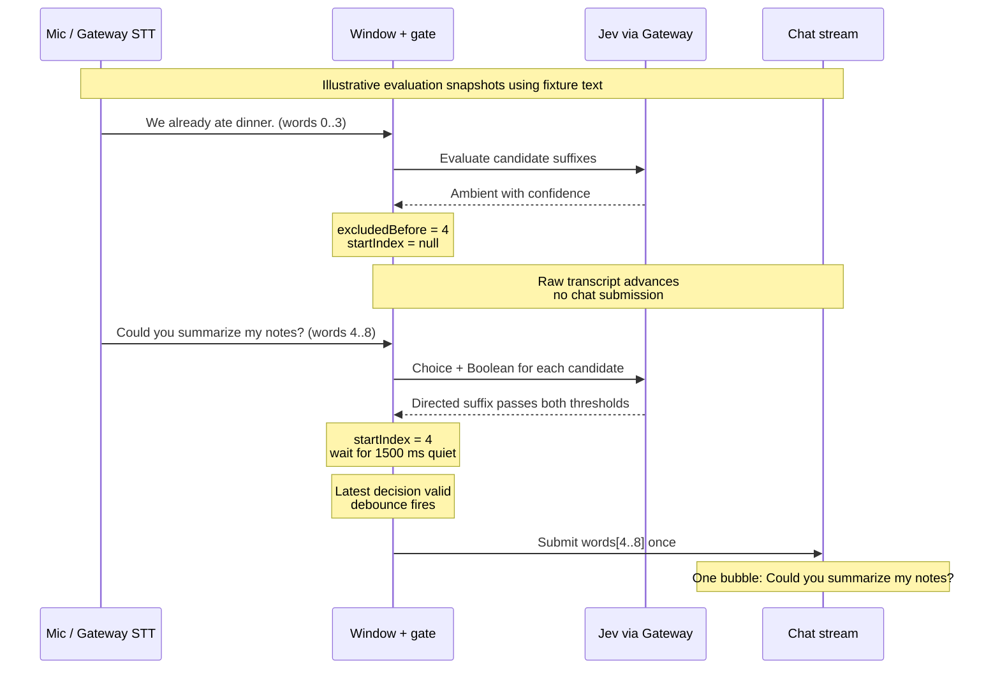

# Jevis

**Always-on speech → streaming STT → Jev directed-speech filter → chat.**

A TV, a side conversation, and a request to your assistant can share one microphone. They shouldn't share one agent input stream. Jevis transcribes continuously, uses **Jev** to find the words addressed to the assistant, and submits only a confident, debounced span. No wake word required.

This is a **Phase 0 TypeScript harness**: inspect the transcript, watch the filter decide, and see exactly what would reach an agent. Chat is a visible output queue; no agent or tools are connected yet.



*Simplified illustration using fixture text and scripted scores. [Static version](docs/assets/sliding-window-poster.png). Live Jev decisions can differ.*

[Run in 5 minutes](#run-in-5-minutes) · [Explore the UI](#explore-the-ui) · [How it works](#how-it-works) · [Commands](#commands-and-configuration) · [Privacy](#privacy-and-phase-0-scope) · [Contribute](#work-on-jevis)



## Run in 5 minutes

### Offline: no keys, no microphone

Install **Node 22+** and npm, then:

```sh
git clone https://github.com/chasemc67/Jevis.git
cd Jevis
npm install
npm run demo:ui
```

Open **http://127.0.0.1:3210** and click **Run offline demo**. In about 11 seconds:

| Raw speech | Chat output |
| --- | --- |
| “The television is still playing.” | Nothing |
| “We already ate dinner. Could you summarize my notes?” | **Could you summarize my notes?** |
| “Maybe later or perhaps tomorrow.” | Nothing |

The demo replays partial/final word events and substitutes explicit fixture labels for Jev. It exercises the real window, gate, debounce, and output path **without cloud requests**. It demonstrates plumbing, not model accuracy. It stays offline even if keys are configured. After dependencies are installed, no internet connection is needed.

### Live: one Gateway key

The live UI captures your microphone in **Chrome/Chromium** with `getUserMedia`; it does not require or launch SoX. From the repo root:

```sh
cp -n .env.example .env
```

Set this line in `.env` to your Vercel AI Gateway key:

```dotenv
AI_GATEWAY_API_KEY=your_gateway_key
```

Then start the live UI:

```sh
npm run mic -- --ui
```

Open the printed URL in Chrome, choose an input in the **Microphone** picker, click **Start mic**, and allow Chrome microphone access. Device labels appear after permission; the picker remembers your choice locally. Stop before choosing a different input. The key must have access to the selected STT model and `typesafe-ai/jev`; no separate OpenAI, xAI, or TypeSafe key is needed. This is the live equivalent of the demo command: `demo:ui` includes fixture-only `--dry-run`, so use `mic -- --ui` for live input.

Use the **STT model** selector to switch **OpenAI `gpt-realtime-whisper` ↔ xAI `grok-stt`**. OpenAI is the default. Switching reconnects STT while capture and chat history stay open; pending filter decisions are invalidated. Audio during reconnection is dropped, so expect a short transcript gap. In fixture mode, the selector only stores a preference for live input.

Keep speaking after each chat submit: one Start supports message 2, 3, and later turns. If a Gateway provider stream ends or has a transient failure, STT reconnects automatically with a short exponential backoff (`stt_reconnect` in the logs). Audio during reconnect is dropped rather than replayed. A normal stream ending preserves completed speech awaiting Jev/debounce; errors invalidate pending decisions. Authentication, access, invalid-request, and malformed-transcript failures stop the session.

Click **Stop** to release the microphone, or close its browser tab. **Ctrl+C** closes the server and capture. A stalled audio connection is stopped after 10 seconds without frames. There is no mute hotkey.

Browser audio uses an AudioWorklet in a 24 kHz Web Audio context (16 kHz for optional Deepgram). Web Audio resamples the physical input. The worklet sends exactly 20 ms of mono signed PCM16 little-endian per binary WebSocket message to the loopback Node server, which forwards it to STT → Jev → chat. The input-level meter is local; microphone audio is never played through the speakers.

**CLI capture and WAV decoding still use SoX.** On macOS, install it with `brew install sox`, then use `npm run mic` or `npm run wav -- --file recordings/example.wav`. Allow microphone access for the launching terminal app when using CLI mic.

<details>
<summary>Microphone, port, or setup trouble?</summary>

- Check `node --version`: the pinned SDKs require Node 22 or newer.
- Select a working input in the browser **Microphone** picker (or **System Settings → Sound → Input** for CLI). A Mac mini may need a USB microphone, headset, or display microphone.
- If browser permission was denied, allow the local site using Chrome’s address-bar site controls or `chrome://settings/content/microphone`. Also enable Chrome under macOS **Privacy & Security → Microphone**. For CLI capture, enable the launching terminal app instead.
- For CLI/WAV only, if SoX is missing from PATH, set `SOX_PATH=/opt/homebrew/bin/sox` in `.env`. `sox -d -n stat` checks capture locally without keys; stop it with Ctrl+C.
- Use `npm run stt -- --ui` to inspect browser STT before adding Jev (`npm run stt` uses CLI/SoX). It still needs the Gateway key.
- If port 3210 is busy, use `npm run demo:ui -- --port 3211`.
- For a stream error, inspect the terminal diagnostics, resolve the key/model/input issue, and start again.

</details>

## Explore the UI



| Panel / control | What to look for |
| --- | --- |
| **A · Chat stream** — always visible | One timestamped bubble per `queue_submit`. Only the accepted `words[startIndex…]` suffix appears. |
| **B · Raw transcript** — toggle **R** | Unfiltered partial/final text, including ambient words and STT revisions; active STT model in the header. |
| **C · Jev / window / decision** — toggle **J** | Indexed words, excluded prefix, candidate probabilities, gate state, debounce, and in-flight/stale counters. |
| **Evaluation history** | Revisit the directed window after the unclear region arrives; choose **Follow latest** to resume updates. |

Raw and Jev start visible. Hiding either preserves its state and keeps processing. **Replay offline demo** clears the previous run and starts fresh. The UI serves bounded recent history over server-sent events from a local Node server at `127.0.0.1`; it has no external frontend assets.

## How it works

Ambient words still advance transcription. The boundary that matters is **submission to Chat**:



### From sound to words

**Sources.** [Browser capture](apps/speech-filter-harness/src/ui/browser.ts) supplies UI microphone PCM through a [local WebSocket source](apps/speech-filter-harness/src/mic/browser.ts). [SoX capture](apps/speech-filter-harness/src/mic/sox.ts) supplies CLI microphone audio or decodes/resamples a WAV and streams it at real-time pace. WAV mode doesn't play through speakers or use batch transcription. [JSON fixtures](apps/speech-filter-harness/fixtures/ambient) enter at the word-event boundary, bypassing audio and STT. Fixtures call real Jev unless `--dry-run` supplies scripted decisions (or `--stt-only` disables filtering).

**Streaming STT.** The [Gateway adapter](apps/speech-filter-harness/src/stt/gateway.ts) uses AI SDK `experimental_streamTranscribe` with `gateway.transcriptionModel(...)`. Both `openai/gpt-realtime-whisper` and `xai/grok-stt` receive mono PCM16 at **24 kHz**, in 20 ms frames. These are text transcription models, not speech-to-speech voice agents. The existing Deepgram Nova-3 adapter is an optional comparison path for later work, enabled explicitly with `STT_PROVIDER=deepgram` and `DEEPGRAM_API_KEY`; it uses 16 kHz audio. It is not needed for the one-key path.

**Normalization.** Every adapter produces the same [WordEvent](apps/speech-filter-harness/src/stt/types.ts): text, word start/end milliseconds, and finality. [Alignment](apps/speech-filter-harness/src/stt/alignment.ts) replaces overlapping interim hypotheses and deduplicates finals. Gateway word timing is synthesized from segment timing and submitted audio duration; it is approximate, not precise word alignment or speaker diarization.

### From words to a directed span

**Sliding window.** Each text update builds candidate suffixes of the latest **1…8 words**, plus the current `startIndex` and the available region start, bounded to **40 words** and any excluded prefix. Indices are zero-based within the region. A confident ambient result advances `excludedBefore` and clears `startIndex`; an eligible directed result sets `startIndex` to the earliest qualifying candidate. In the example, words 0–3 are excluded and the request starts at **4**. This trims a prefix; it doesn't extract arbitrary disconnected phrases.

**Jev, through Gateway only.** The [Jev client](apps/speech-filter-harness/src/jev/client.ts) uses `experimental_evaluate` and `gateway.evaluationModel('typesafe-ai/jev')`. One request batches a **Choice** (`directed`, `ambient`, `unclear`) and a **Boolean** (`is_directed`) for every candidate. Jev sees text/JSON context, never raw audio. There is no direct TypeSafe API path.

**Gate and debounce.** A candidate must be labeled `directed`, with Choice probability **≥ 0.6** and Boolean probability **≥ 0.6**. The default **1500 ms** quiet interval must also elapse. A text revision revokes eligibility until its own evaluation passes; the latest matching decision must authorize the exact submitted span. Ambient is excluded, unclear/low confidence holds, and disconnection, malformed answers, errors, or timeouts **fail closed**. A pause alone cannot submit text.

**Regions and output.** Endpoint/final boundaries or the default 1500 ms silence timeout close a region without skipping its debounce. A sealed region may finish its own pending evaluation; a new region starts with fresh gate/index state. Submission consumes the audio time range so delayed corrections can't submit it again. [DownstreamModel](apps/speech-filter-harness/src/downstream/types.ts) currently has console and bounded memory-queue implementations only. Chat displays those submitted segments, never raw STT previews.

### Keeping up with speech

STT callbacks never wait for Jev. The [controller](apps/speech-filter-harness/src/filter/controller.ts) permits **one evaluator operation at a time**. New words cancel/supersede older work and retain only the latest pending snapshot; the slot stays occupied until cancellation settles. Region and sequence checks ignore stale results, so an older decision cannot authorize newer text. Multiple words in one STT update are coalesced. New speech can conservatively drop unfinished work from a prior region.

The decision panel and logs expose `jev_inflight_dropped`, `jev_stale_ignored`, and evaluation latency. Jev retries a 429/5xx once within a **4-second total deadline**. Continuous Gateway mic sessions reconnect after normal EOF, transient errors, or an audio backlog over one second, dropping stale queued audio. Fatal Gateway errors stop capture. A normal EOF preserves finalized regions awaiting their submit debounce; interrupted hypotheses and provider errors invalidate pending decisions. The optional Deepgram adapter reconnects with backoff. WAV sessions drain once and finish.

## Commands and configuration

Run from the repo root. `.env` loads automatically; exported environment variables take precedence.

| Command | What runs | Key |
| --- | --- | --- |
| `npm run demo:ui` | Offline visual demo | None |
| `npm run demo` | Same offline scenario as JSON console output | None |
| `npm run fixture -- --ui` | Fixture words + real Jev | Gateway |
| `npm run mic -- --ui` | Microphone + live STT + real Jev | Gateway |
| `npm run stt -- --ui` | Microphone + live STT; Jev/Chat idle | Gateway |
| `npm run wav -- --file recordings/example.wav --ui` | WAV + live STT + real Jev | Gateway |
| `npm run check` | Typecheck, regression tests, production build | None |

Remove `--ui` from live commands for console output. `npm run ui` aliases the offline visual demo. Use `--downstream queue` for the in-memory queue (up to 1,000 segments; lost on exit). `npm run dev -- --help` lists all CLI options.

[.env.example](.env.example) lists every setting. The main controls are:

| Setting | Default | Purpose |
| --- | --- | --- |
| `STT_MODEL` | `openai/gpt-realtime-whisper` | Choose this or `xai/grok-stt`; also selectable in the UI |
| `JEV_EVERY_N_WORDS` | `1` | Evaluate on updates; use `2` or `3` for profiling |
| `K` / `WINDOW_MAX_WORDS` | `8` / `40` | Candidate suffix lengths / maximum window |
| `T_DIR_CONFIDENCE` / `T_NOUL` | `0.6` / `0.6` | Choice / Boolean thresholds |
| `DEBOUNCE_MS` | `1500` | Quiet interval, allowed range 1000–2000 ms |
| `REGION_SILENCE_MS` | `1500` | Region closure, allowed range 1500–2000 ms |
| `JEV_TIMEOUT_MS` | `4000` | Total evaluation deadline, including retry |

`--stt-model xai/grok-stt` overrides `STT_MODEL` and selects Gateway, even if an old `.env` selects Deepgram. A Deepgram selection without its key also falls back to Gateway. `JEV_MODEL` is fixed to `typesafe-ai/jev`.

To replay another offline case:

```sh
npm run fixture -- --file apps/speech-filter-harness/fixtures/ambient/ambient-only.json --dry-run --ui
```

The bundled `ambient-only.json` and `unclear.json` emit zero segments. Keep replay speed at its default `1` when comparing expected outputs: `--speed` changes event pacing, not debounce or model deadlines.

## Privacy and Phase 0 scope

**Always-on means ambient audio is captured too.** During a live mic run, audio goes through Vercel AI Gateway to the selected STT provider (directly to Deepgram if explicitly selected). Transcript context and candidates go to Jev through Gateway, including words that never enter Chat. Filtering agent input is not a local-only privacy boundary.

The harness does not record audio. Transcripts appear in the local console/browser; redirecting or sharing logs can retain them. The Gateway key stays in the local Node server, never the browser. Keep secrets in ignored `.env` and private audio in ignored `recordings/`. Offline dry-run makes no cloud requests; real fixture evaluation sends fixture text to Gateway. `GATEWAY_ZERO_DATA_RETENTION=true` requests Jev routing with zero data retention; it makes no claim about STT retention.

Phase 0 stops at a visible text feed. **No real agent, tool execution, TTS, speech-to-speech conversation, barge-in UX, or primary wake-word gate.** Scripted demos and transport tests do not establish classification accuracy. Validate live ambient, directed, and ambiguous speech before connecting any agent.

## Work on Jevis

- Read [ARCHITECTURE.md](ARCHITECTURE.md) for the build spec and acceptance criteria.
- Agents changing Jev prompts, question shapes, or Gateway wiring must first read the vendored [TypeSafe skill](skills/typesafe-ai/SKILL.md) and [project skill guidance](skills/README.md). The project always routes Jev through Gateway.
- Start in [`apps/speech-filter-harness/src`](apps/speech-filter-harness/src): `stt/` normalizes speech, `filter/` controls eligibility, `jev/` evaluates candidates, and `ui/` renders telemetry.
- To add an STT adapter, implement the [SttAdapter contract](apps/speech-filter-harness/src/stt/session.ts), emit normalized word/boundary/connection callbacks, and wire provider selection in `main.ts` and `config.ts`. Add alignment/reconnect tests before using it with the filter.
- Run `npm run check` before proposing a change. The suite covers fixture replay, transport mocks, alignment, cancellation, debounce, fail-closed behavior, UI controls, browser PCM transport/cleanup, continuous multi-submit sessions, and SoX WAV conversion when SoX is installed. When Chrome/Chromium is installed (or `CHROME_PATH` is set), it also runs a headless browser test with a synthetic microphone; that test makes no cloud requests.
- Visuals are local and reproducible: [asset sources and generation instructions](docs/assets/README.md). The Mermaid sources are [pipeline.mmd](docs/assets/pipeline.mmd) and [ambient-directed.mmd](docs/assets/ambient-directed.mmd).
